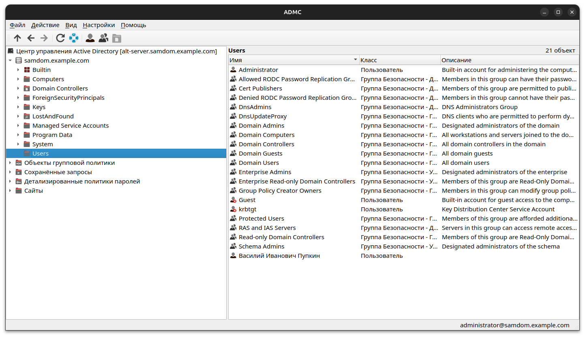

# ADMC

**ADMC** (AD Management Center) is a Qt-based GUI application for Active
Directory management, replicating core functions of Microsoft RSAT "Users and
Computers" and "Group Policy Management".

## Dependencies
Required:
* [ad-integration-themes](https://github.com/Samael-fhts/ad-integration-themes)
* [GLIBC](https://www.gnu.org/software/libc/) (for `resolv` library)
* [Kerberos](https://github.com/krb5/krb5) 5 (`libkrb5`)
* [LDAP](https://www.openldap.org/) (`libldap`)
* [Qt6](https://www.qt.io/) (base, core, widgets, help, tools, linguist tools,
  svg)
* [SASL](https://www.cyrusimap.org/sasl/) (`libsasl2`, `libsasl2-plugin-gssapi`)
* [Samba](https://www.samba.org/) (`libsmbclient`, `libndr`)
* [libcng-dpapi](https://github.com/august-alt/libcng-dpapi)
* [libgkdi](https://github.com/august-alt/libgkdi/)
* [util-linux](https://git.kernel.org/pub/scm/utils/util-linux/util-linux.git/) (`libuuid`)

Optional build-time dependencies:
* [ClangFormat](https://clang.llvm.org/docs/ClangFormat.html) -- a build-time
  dependency that is used by the auxiliary `clangformat` target.
* [Doxygen](https://www.doxygen.nl/index.html)

### ALT distributions

On modern ALT Linux distributions the required dependencies can be installed as
follows:
```shell
$ su -
$ apt-get update
$ apt-get install \
    ad-integration-themes \
    libcng-dpapi-devel \
    libgkdi-devel \
    libkrb5-devel \
    libldap-devel \
    libsasl2-devel \
    libsasl2-plugin-gssapi \
    libsmbclient-devel \
    libuuid-devel \
    qt6-base-devel \
    qt6-linguist \
    qt6-qtbase \
    qt6-svg \
    qt6-tools-devel \
    samba-devel
```

## Building

### Getting the ADMC sources
```shell
git clone https://github.com/altlinux/admc
cd admc
```

### Manual building
Once dependencies are installed, ADMC can be built by running the following
commands in the cloned repository:
```shell
$ mkdir build
$ cd build
$ cmake ..
$ make -j$(nproc)
```

### Building RPM packages with Gear
Alternatively ADMC can be built as a set of RPM packages with the help of
[Gear](https://en.altlinux.org/Gear):
```shell
$ gear-rpm -ba
```

This `gear-rpm` command produces the following RPM files in `~/RPM/` directory
(where `<version>` is the current ADMC version):
- `~/RPM/SRPMS/admc-<version>-alt1.x86_64.rpm` -- source code package.
- `~/RPM/RPMS/x86_64/admc-<version>-alt1.x86_64.rpm` -- compiled ADMC binaries.
- `~/RPM/RPMS/x86_64/admc-test-<version>-alt1.x86_64.rpm` -- unit tests.
- `~/RPM/RPMS/x86_64/admc-debuginfo-<version>-alt1.x86_64.rpm` -- debug
  information for ADMC.
- `~/RPM/RPMS/x86_64/admc-test-debuginfo-<version>-alt1.x86_64.rpm` -- debug
  information for unit tests.

### Source code auto-formatting
You can also format the sources by building `clangformat` target after `cmake`
is run, for example:

```shell
$ make -C build clangformat
```

## Usage

This application requires a working Active Directory domain and for the client
machine to be connected and logged into the domain. You can find articles about
these topics on [ALTLinux
wiki](https://www.altlinux.org/%D0%94%D0%BE%D0%BC%D0%B5%D0%BD).

Launch ADMC from the build directory:
```
$ ./admc
```

## Testing

Tests also require a domain and a connection to the domain.

Launch tests from the build directory:
```
$ ./admc-test
```

## Contributing

See [CONTRIBUTING.md](./CONTRIBUTING.md) file for contributing guidelines.

## Screenshots


